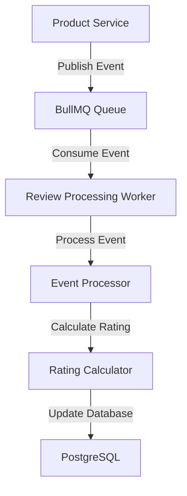

# Review Processing Service Documentation

The Review Processing Service is a background worker service responsible for asynchronous review processing and real-time average rating calculations. It consumes events from the Product Service via BullMQ and maintains up-to-date product ratings.

## 📑 Table of Contents

- [Service Overview](#-service-overview)
- [Architecture](#-architecture)
- [Event Processing](#-event-processing)
- [Rating Calculation](#-rating-calculation)


## 🏗 Service Overview

### Purpose
- **Asynchronous Processing**: Handle review events without blocking the main API
- **Rating Calculations**: Compute and store average product ratings
- **Cache Management**: Update Redis cache with calculated ratings
- **Horizontal Scaling**: Support multiple worker instances for high throughput

### Technology Stack
- **Runtime**: Node.js with TypeScript
- **Queue System**: BullMQ for job processing
- **Database**: Prisma ORM
- **Logging**: Pino structured logging
- **Cache**: Redis for rating cache updates

### Key Features
- ✅ **Event-Driven Architecture**: Consumes events from BullMQ queue
- ✅ **Concurrent Processing**: Configurable worker concurrency
- ✅ **Multi-Instance Support**: Horizontal scaling with automatic load distribution

## 🏛 Architecture

### Service Components

```
Review Processing Service
├── Event Subscriber (BullMQ Worker)
├── Event Processor
│   ├── Review Created Handler
│   ├── Review Updated Handler
│   └── Review Deleted Handler
├── Rating Calculator
│   ├── Aggregation Logic
│   ├── Database Updates
│   └── Cache Updates
└── Error Handling & Logging
```

### Data Flow




## 🔄 Event Processing

### Supported Event Types

The service processes three types of review events:

#### 1. Review Created
```typescript
interface ReviewCreatedEvent {
  type: 'review.created';
  productId: string;
  reviewId: string;
  rating: number;
  timestamp: string;
}
```

**Processing Logic:**
1. Validate event data
2. Calculate new average rating for product
3. Update `product_ratings` table
4. Update Redis cache
5. Log completion

#### 2. Review Updated
```typescript
interface ReviewUpdatedEvent {
  type: 'review.updated';
  productId: string;
  reviewId: string;
  rating: number;
  oldRating: number;
  timestamp: string;
}
```

**Processing Logic:**
1. Validate event data and rating change
2. Recalculate average rating for product
3. Update database with new values
4. Invalidate and update cache
5. Log rating change details

#### 3. Review Deleted
```typescript
interface ReviewDeletedEvent {
  type: 'review.deleted';
  productId: string;
  reviewId: string;
  rating: number;
  timestamp: string;
}
```

**Processing Logic:**
1. Validate event data
2. Recalculate average without deleted review
3. Update database (or remove if no reviews left)
4. Update cache with new rating
5. Log deletion impact

## 🧮 Rating Calculation

### Calculation Strategy

The service uses a **recalculation approach** for accuracy and simplicity:

1. **Query all reviews** for the product
2. **Calculate average** from current data
3. **Update database** with new values
4. **Update cache** for fast retrieval
